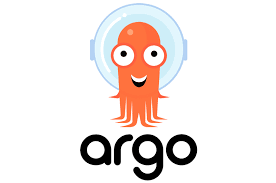
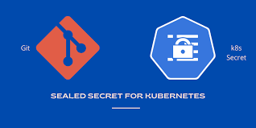
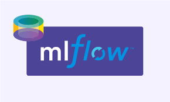
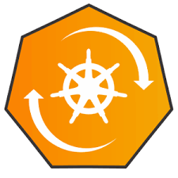

# 🚀 GitOps and DevOps Toolkit 🛠️

Welcome to our GitOps and DevOps Toolkit repository! This toolkit contains essential components to streamline your GitOps processes and enhance your DevOps practices. Below, we'll walk you through the stack description, provide an overview of the key deployments, and demonstrate how each component contributes to your development and deployment workflows.

## Stack Description

Our stack comprises various tools and utilities tailored to facilitate GitOps practices in synergy with DevOps methodologies. Here's a breakdown of the components included:

### Continuous Deployment (CD): Argocd

Argocd simplifies and automates your continuous deployment process by leveraging GitOps principles. It ensures that the desired state of your Kubernetes applications matches the state defined in your Git repositories, thereby promoting consistency and reliability across environments.

### Workflows: Argo Workflows

Argo Workflows orchestrates complex workflows in Kubernetes, enabling you to automate and streamline your CI/CD pipelines. With support for parallelism, branching, and custom logic, Argo Workflows empowers you to build resilient and scalable automation solutions tailored to your specific requirements.

### Secrets Management: Seal-secrets

Seal-secrets provides a secure and GitOps-friendly approach to managing sensitive information within your Kubernetes clusters. By encrypting secrets using asymmetric encryption and storing them alongside your application manifests, Seal-secrets ensures that your secrets remain protected throughout their lifecycle.

### ML Storage: MLFLOW Server

MLFLOW Server serves as a centralized repository for managing and tracking machine learning experiments, models, and artifacts. With MLFLOW Server integrated into your GitOps workflow, you can seamlessly version control your machine learning projects and collaborate effectively across teams.

### Sharing: Reflector

![Reflector]

Reflector facilitates real-time synchronization of Kubernetes resources across multiple clusters, enabling you to share and replicate application configurations effortlessly. Whether you're deploying applications across hybrid-cloud environments or implementing disaster recovery strategies, Reflector ensures consistency and resilience across your Kubernetes infrastructure.

### Autodeployment: Reloader

Reloader automatically detects changes to Kubernetes resources and triggers the necessary updates, eliminating the need for manual intervention during deployments. By dynamically reloading configurations in response to changes, Reloader enhances the agility and efficiency of your GitOps pipelines, allowing you to deliver updates rapidly and reliably.